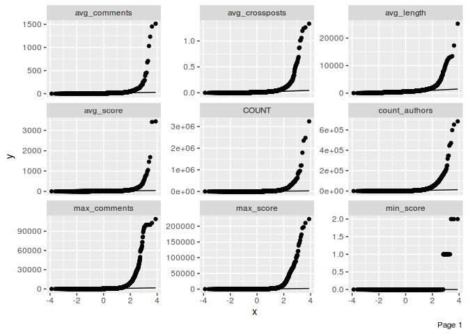
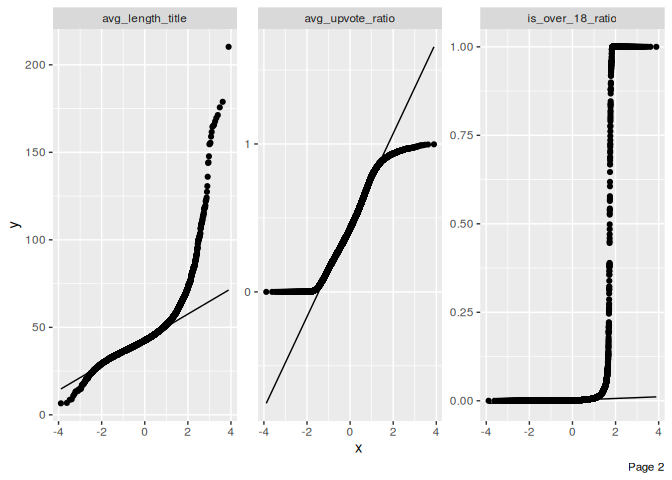
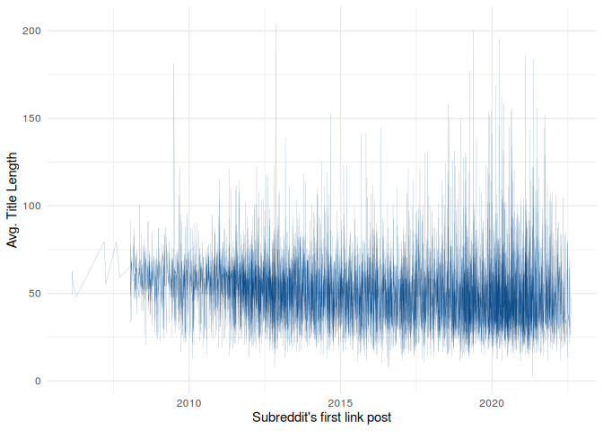
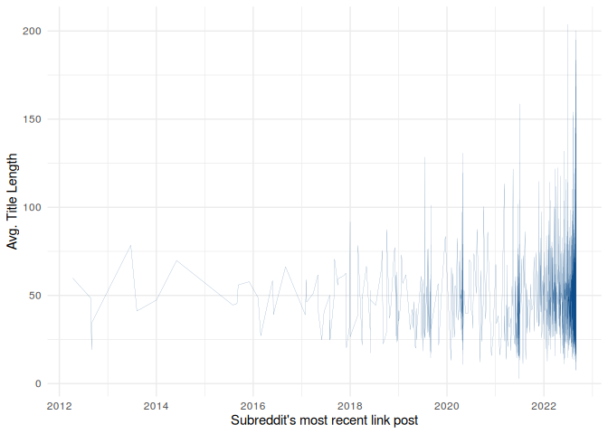

subreddit insights
================

Load data:

``` r
require(data.table)
```

    ## Loading required package: data.table

``` r
setwd('/home/xk/github/xk/reddit_mining')

stats_link = fread('zstdcat subreddit_stats_link.csv.zst')
stats_text = fread('zstdcat subreddit_stats_text.csv.zst')
stats_text
```

    ##                      subreddit     oldest    avg_age     latest
    ##       1:                       1388561511 1460435625 1514706726
    ##       2:         *polhold01359 1626166287 1627808085 1629279706
    ##       3:        *polhold999999 1539884838 1539884838 1539884838
    ##       4:          *tmhold00340 1539148851 1540453062 1540891876
    ##       5:                 00000 1503217479 1503680957 1504144435
    ##      ---
    ## 2744681:      zzzzzzzzzzzzzzzz 1576493012 1576493012 1576493012
    ## 2744682:  zzzzzzzzzzzzzzzzzzas 1653235439 1653235439 1653235439
    ## 2744683:  zzzzzzzzzzzzzzzzzzzz 1449614047 1546039212 1616387772
    ## 2744684: zzzzzzzzzzzzzzzzzzzzx 1599722081 1600175829 1600327138
    ## 2744685: zzzzzzzzzzzzzzzzzzzzz 1450445110 1453962249 1456579989
    ##          avg_time_to_edit min_score avg_score max_score avg_comments
    ##       1:          -461769         0  2.651789      1221    3.8111445
    ##       2:               NA         1  1.000000         1    0.0000000
    ##       3:               NA         1  1.000000         1    0.0000000
    ##       4:               NA         1  1.000000         1    0.0000000
    ##       5:               NA         1  1.000000         1    0.5000000
    ##      ---
    ## 2744681:               NA         1  1.000000         1    1.0000000
    ## 2744682:               NA         1  1.000000         1    0.0000000
    ## 2744683:               NA         0  1.370370         4    0.6666667
    ## 2744684:               NA         1  1.250000         2    0.0000000
    ## 2744685:               NA         1  1.000000         1    1.0000000
    ##          max_comments avg_crossposts COUNT count_authors avg_length
    ##       1:         4288              0 22271         11229  916.07858
    ##       2:            0              0    14             1  515.50000
    ##       3:            0              0     1             1   26.00000
    ##       4:            0              0     4             1  315.50000
    ##       5:            1              0     2             2  374.50000
    ##      ---
    ## 2744681:            1              0     1             1   16.00000
    ## 2744682:            0              0     1             1   69.00000
    ## 2744683:            4              0    27            22  972.11111
    ## 2744684:            0              0     4             2 3642.50000
    ## 2744685:            1             NA     7             2   12.42857
    ##          avg_length_title avg_upvote_ratio is_over_18_ratio
    ##       1:         74.85919        0.0000000      0.007094428
    ##       2:         58.28571        1.0000000      0.000000000
    ##       3:         12.00000        0.0000000      0.000000000
    ##       4:         60.75000        0.0000000      0.000000000
    ##       5:         23.00000        0.0000000      0.000000000
    ##      ---
    ## 2744681:         18.00000        0.0000000      1.000000000
    ## 2744682:         29.00000        1.0000000      0.000000000
    ## 2744683:         55.11111        0.2159259      0.000000000
    ## 2744684:         92.50000        1.0000000      0.000000000
    ## 2744685:         87.14286        0.0000000      0.000000000

I’m not 100% sure what the `""` subreddit is. The data that those
records originate from seem to be mostly spam. Maybe these records are
incorrectly articulated programmatic submissions? Because that data is
tiny, I’ve uploaded the full records to this repo under
`null_subreddit_*`:

It seems like a lot of data is user subreddits so I will remove those
because:

1.  they are less interesting
2.  they will need to be interpreted differently in any analysis
3.  I’m not sure how accurate they are because my user subreddit has
    only one record from four years ago. (Am I shadow banned??? I must
    be on some list somewhere because I also get 0 likes on bumble. oh
    well\~\~ The data analysis which
    [follows](https://youtube.com/watch?v=x8llJbEDA0g) is hopefully more
    interesting than my well-being)

``` r
fwrite(stats_link[subreddit %like% '^u_'], 'user_stats_link.csv')
fwrite(stats_text[subreddit %like% '^u_'], 'user_stats_text.csv')
fwrite(stats_link[!(subreddit %like% '^u_')], 'subreddit_stats_link.csv')
fwrite(stats_text[!(subreddit %like% '^u_')], 'subreddit_stats_text.csv')
```

The first thing that we can see is that about half of all subreddits
only one post of either type.

The median subreddit has 3 link posts and 1 text post… although keep in
mind that these variables were observed independently–a subreddit has to
have at least one link post to show up in the stats_link data and
likewise for text posts and stats_text. It seems like it should be okay
to compare the values because they are independent variables but maybe
it’s not okay to combine values like that? I’m not sure. Statisticians,
please let me know.

``` r
summary(stats_link)
```

    ##   subreddit             oldest             avg_age              latest
    ##  Length:2666516     Min.   :1.120e+09   Min.   :1.165e+09   Min.   :1.201e+09
    ##  Class :character   1st Qu.:1.509e+09   1st Qu.:1.542e+09   1st Qu.:1.567e+09
    ##  Mode  :character   Median :1.592e+09   Median :1.600e+09   Median :1.619e+09
    ##                     Mean   :1.561e+09   Mean   :1.577e+09   Mean   :1.593e+09
    ##                     3rd Qu.:1.632e+09   3rd Qu.:1.636e+09   3rd Qu.:1.648e+09
    ##                     Max.   :1.662e+09   Max.   :1.662e+09   Max.   :1.662e+09
    ##
    ##  avg_time_to_edit       min_score          avg_score          max_score
    ##  Min.   :-1.337e+09   Min.   :    0.00   Min.   :    0.00   Min.   :     0.0
    ##  1st Qu.: 9.440e+02   1st Qu.:    1.00   1st Qu.:    1.00   1st Qu.:     1.0
    ##  Median : 1.253e+04   Median :    1.00   Median :    1.00   Median :     1.0
    ##  Mean   :-3.957e+06   Mean   :    1.04   Mean   :    3.97   Mean   :    65.8
    ##  3rd Qu.: 1.004e+05   3rd Qu.:    1.00   3rd Qu.:    2.00   3rd Qu.:     4.0
    ##  Max.   : 2.332e+08   Max.   :40103.00   Max.   :40103.00   Max.   :491562.0
    ##  NA's   :2488572
    ##   avg_comments        max_comments       avg_crossposts       COUNT
    ##  Min.   :    -3.67   Min.   :    -1.00   Min.   :  0.0    Min.   :       1
    ##  1st Qu.:     0.00   1st Qu.:     0.00   1st Qu.:  0.0    1st Qu.:       1
    ##  Median :     0.00   Median :     0.00   Median :  0.0    Median :       3
    ##  Mean   :     1.11   Mean   :    13.23   Mean   :  0.0    Mean   :     504
    ##  3rd Qu.:     0.53   3rd Qu.:     2.00   3rd Qu.:  0.0    3rd Qu.:      12
    ##  Max.   :100000.00   Max.   :213573.00   Max.   :231.2    Max.   :29685781
    ##                                          NA's   :331602
    ##  count_authors       avg_length       avg_length_title avg_upvote_ratio
    ##  Min.   :      1   Min.   :    4.00   Min.   :  1.00   Min.   :0.0000
    ##  1st Qu.:      1   1st Qu.:   38.67   1st Qu.: 19.43   1st Qu.:0.0000
    ##  Median :      2   Median :   57.00   Median : 31.12   Median :0.8831
    ##  Mean   :    100   Mean   :   60.05   Mean   : 39.39   Mean   :0.5622
    ##  3rd Qu.:      3   3rd Qu.:   76.00   3rd Qu.: 51.25   3rd Qu.:1.0000
    ##  Max.   :4622381   Max.   :50710.33   Max.   :458.00   Max.   :1.0000
    ##                                       NA's   :10
    ##  is_over_18_ratio
    ##  Min.   :0.0000
    ##  1st Qu.:0.0000
    ##  Median :0.0000
    ##  Mean   :0.1712
    ##  3rd Qu.:0.0000
    ##  Max.   :1.0000
    ##

``` r
summary(stats_text)
```

    ##   subreddit             oldest             avg_age              latest
    ##  Length:2744685     Min.   :1.237e+09   Min.   :1.245e+09   Min.   :1.245e+09
    ##  Class :character   1st Qu.:1.553e+09   1st Qu.:1.563e+09   1st Qu.:1.575e+09
    ##  Mode  :character   Median :1.610e+09   Median :1.614e+09   Median :1.621e+09
    ##                     Mean   :1.578e+09   Mean   :1.588e+09   Mean   :1.598e+09
    ##                     3rd Qu.:1.640e+09   3rd Qu.:1.641e+09   3rd Qu.:1.647e+09
    ##                     Max.   :1.662e+09   Max.   :1.662e+09   Max.   :1.662e+09
    ##
    ##  avg_time_to_edit       min_score          avg_score
    ##  Min.   :-105559634   Min.   :   0.000   Min.   :    0.000
    ##  1st Qu.:   -191334   1st Qu.:   1.000   1st Qu.:    1.000
    ##  Median :    -27852   Median :   1.000   Median :    1.000
    ##  Mean   :  16650310   Mean   :   1.287   Mean   :    2.281
    ##  3rd Qu.:     -1164   3rd Qu.:   1.000   3rd Qu.:    1.750
    ##  Max.   :1337017976   Max.   :2588.000   Max.   :10659.498
    ##  NA's   :2353513
    ##    max_score          avg_comments        max_comments      avg_crossposts
    ##  Min.   :     0.00   Min.   :   -12.00   Min.   :   -12.0   Min.   :  0.00
    ##  1st Qu.:     1.00   1st Qu.:     0.00   1st Qu.:     0.0   1st Qu.:  0.00
    ##  Median :     1.00   Median :     0.00   Median :     0.0   Median :  0.00
    ##  Mean   :    19.68   Mean   :     3.26   Mean   :    18.9   Mean   :  0.01
    ##  3rd Qu.:     2.00   3rd Qu.:     1.00   3rd Qu.:     2.0   3rd Qu.:  0.00
    ##  Max.   :281879.00   Max.   :100001.00   Max.   :358867.0   Max.   :793.00
    ##                                                             NA's   :291254
    ##      COUNT         count_authors         avg_length      avg_length_title
    ##  Min.   :      0   Min.   :      1.0   Min.   :    1.0   Min.   :  1.0
    ##  1st Qu.:      1   1st Qu.:      1.0   1st Qu.:   58.0   1st Qu.: 19.0
    ##  Median :      1   Median :      1.0   Median :   67.0   Median : 25.0
    ##  Mean   :    129   Mean   :     52.8   Mean   :  321.9   Mean   : 30.3
    ##  3rd Qu.:      3   3rd Qu.:      2.0   3rd Qu.:  224.8   3rd Qu.: 34.0
    ##  Max.   :3280604   Max.   :1025425.0   Max.   :52010.5   Max.   :386.0
    ##                                                          NA's   :55
    ##  avg_upvote_ratio is_over_18_ratio
    ##  Min.   :0.0000   Min.   :0.000
    ##  1st Qu.:0.0000   1st Qu.:0.000
    ##  Median :1.0000   Median :0.000
    ##  Mean   :0.6357   Mean   :0.151
    ##  3rd Qu.:1.0000   3rd Qu.:0.000
    ##  Max.   :1.0000   Max.   :1.000
    ##

You can see the count of subreddits which have a low number of
submissions like this:

``` r
data.table(sort(table(stats_text$count)))[N > 32000]
```

    ##    V1       N
    ## 1:  5   39939
    ## 2:  4   61504
    ## 3:  3  108724
    ## 4:  2  266846
    ## 5:  1 2006830

``` r
data.table(sort(table(stats_link$count)))[N > 96000]
```

    ##    V1       N
    ## 1:  4  105858
    ## 2:  3  189967
    ## 3:  2  501403
    ## 4:  1 1315410

Though that may only be because some subreddits have only “link” posts
enabled or only “text” posts enabled. We will need to create a third
dataset to evaluate that:

``` r
setkey(stats_link, "subreddit")
setkey(stats_text, "subreddit")
stats_both = stats_link[stats_text, nomatch=FALSE]
data.table(sort(table(stats_both$COUNT + stats_both$i.COUNT)))[N > 32000]
```

    ##     V1      N
    ##  1: 11  34294
    ##  2: 10  38693
    ##  3:  9  45725
    ##  4:  8  53710
    ##  5:  7  64536
    ##  6:  6  79877
    ##  7:  5 101873
    ##  8:  4 139473
    ##  9:  3 210091
    ## 10:  2 329342

Maybe it explains some of the data but there are still many subreddits
which have very few posts.

``` r
full_outer_join = merge(stats_link, stats_text, all=TRUE)
stats_antijoin = full_outer_join[is.na(COUNT.x) | is.na(COUNT.y)]
rm(full_outer_join)
gc()
```

    ##             used   (Mb) gc trigger   (Mb)  max used   (Mb)
    ## Ncells   4239657  226.5    8219801  439.0   4367596  233.3
    ## Vcells 200026909 1526.1  394770566 3011.9 389090219 2968.6

``` r
stats_antijoin
```

    ##                      subreddit   oldest.x  avg_age.x   latest.x
    ##       1:          *cohold00009 1544039034 1544044872 1544056468
    ##       2:          *cohold00022 1564702476 1575220324 1576623585
    ##       3:         *polhold00214 1524685111 1529871405 1540243886
    ##       4:         *polhold00575 1560417012 1560417715 1560418100
    ##       5:         *polhold01359         NA         NA         NA
    ##      ---
    ## 1838987: zzzzzzzzzzzffzzzzzzzz         NA         NA         NA
    ## 1838988:     zzzzzzzzzzzzezzez         NA         NA         NA
    ## 1838989:        zzzzzzzzzzzzzq         NA         NA         NA
    ## 1838990:      zzzzzzzzzzzzzz15 1384553494 1395693425 1406833356
    ## 1838991:       zzzzzzzzzzzzzzz 1499155984 1499156087 1499156190
    ##          avg_time_to_edit.x min_score.x avg_score.x max_score.x avg_comments.x
    ##       1:                 NA           1   1.0000000           1              0
    ##       2:                 NA           0   2.1304348           9              0
    ##       3:                 NA           1   1.0000000           1              0
    ##       4:                 NA           0   0.3333333           1              0
    ##       5:                 NA          NA          NA          NA             NA
    ##      ---
    ## 1838987:                 NA          NA          NA          NA             NA
    ## 1838988:                 NA          NA          NA          NA             NA
    ## 1838989:                 NA          NA          NA          NA             NA
    ## 1838990:                 NA           0   1.0000000           2              0
    ## 1838991:                 NA           1   1.0000000           1              0
    ##          max_comments.x avg_crossposts.x COUNT.x count_authors.x avg_length.x
    ##       1:              0                0       3               1     27.66667
    ##       2:              0                0      46               1    196.86957
    ##       3:              0                0       3               1     64.66667
    ##       4:              0                0       3               1     90.00000
    ##       5:             NA               NA      NA              NA           NA
    ##      ---
    ## 1838987:             NA               NA      NA              NA           NA
    ## 1838988:             NA               NA      NA              NA           NA
    ## 1838989:             NA               NA      NA              NA           NA
    ## 1838990:              0               NA       2               2     26.50000
    ## 1838991:              0               NA       2               1     58.00000
    ##          avg_length_title.x avg_upvote_ratio.x is_over_18_ratio.x   oldest.y
    ##       1:          169.33333                  0                  0         NA
    ##       2:          176.73913                  0                  0         NA
    ##       3:           52.66667                  0                  1         NA
    ##       4:          200.66667                  0                  0         NA
    ##       5:                 NA                 NA                 NA 1626166287
    ##      ---
    ## 1838987:                 NA                 NA                 NA 1572997953
    ## 1838988:                 NA                 NA                 NA 1645645480
    ## 1838989:                 NA                 NA                 NA 1627506057
    ## 1838990:           14.00000                  0                  0         NA
    ## 1838991:           41.00000                  0                  0         NA
    ##           avg_age.y   latest.y avg_time_to_edit.y min_score.y avg_score.y
    ##       1:         NA         NA                 NA          NA          NA
    ##       2:         NA         NA                 NA          NA          NA
    ##       3:         NA         NA                 NA          NA          NA
    ##       4:         NA         NA                 NA          NA          NA
    ##       5: 1627808085 1629279706                 NA           1           1
    ##      ---
    ## 1838987: 1572997953 1572997953                 NA           1           1
    ## 1838988: 1645645480 1645645480                 NA           1           1
    ## 1838989: 1627506057 1627506057                 NA           1           1
    ## 1838990:         NA         NA                 NA          NA          NA
    ## 1838991:         NA         NA                 NA          NA          NA
    ##          max_score.y avg_comments.y max_comments.y avg_crossposts.y COUNT.y
    ##       1:          NA             NA             NA               NA      NA
    ##       2:          NA             NA             NA               NA      NA
    ##       3:          NA             NA             NA               NA      NA
    ##       4:          NA             NA             NA               NA      NA
    ##       5:           1              0              0                0      14
    ##      ---
    ## 1838987:           1              0              0                0       1
    ## 1838988:           1              0              0                0       1
    ## 1838989:           1              0              0                0       1
    ## 1838990:          NA             NA             NA               NA      NA
    ## 1838991:          NA             NA             NA               NA      NA
    ##          count_authors.y avg_length.y avg_length_title.y avg_upvote_ratio.y
    ##       1:              NA           NA                 NA                 NA
    ##       2:              NA           NA                 NA                 NA
    ##       3:              NA           NA                 NA                 NA
    ##       4:              NA           NA                 NA                 NA
    ##       5:               1        515.5           58.28571                  1
    ##      ---
    ## 1838987:               1          9.0           38.00000                  0
    ## 1838988:               1         66.0           26.00000                  1
    ## 1838989:               1         63.0           23.00000                  1
    ## 1838990:              NA           NA                 NA                 NA
    ## 1838991:              NA           NA                 NA                 NA
    ##          is_over_18_ratio.y
    ##       1:                 NA
    ##       2:                 NA
    ##       3:                 NA
    ##       4:                 NA
    ##       5:                  0
    ##      ---
    ## 1838987:                  0
    ## 1838988:                  0
    ## 1838989:                  0
    ## 1838990:                 NA
    ## 1838991:                 NA

So far, we’ve figured out that there are 1,838,991 subreddits which
exist only in one of the ‘link’ or ‘text’ datasets and there are
1,786,105 subreddits which exist in both datasets. This is not duplicate
data per se, it just means that there are 1,838,991 subreddits which
either: a) ONLY have ‘link’ posts or b) ONLY have ‘text’ posts; and
there are 1,786,105 subreddits which have both ‘link’ and ‘text’ posts.

Hypothetically, there are a large number of subreddits which people:

1.  Accidentally created
2.  Created with many plans to promote and encourage activity but for
    whatever reason they lost momentum or the market didn’t exist yet
3.  Some combination of 1 and 2

Because of this, I feel, for this analysis, I have enough reason to
ignore subreddits which have fewer than 20 total posts and fewer than 10
distinct posting users:

``` r
stats_text = stats_text[COUNT >= 600 & count_authors >= 15]
stats_link = stats_link[COUNT >= 600 & count_authors >= 15]
```

As well as removing subreddits where there wasn’t a lot of upvoting or
commenting going on. I’m not sure if there are subreddits where comments
are disabled. I imagine that would defeat the point of reddit? But I am
assuming that feature does not exist:

``` r
stats_text = stats_text[max_score >= 60 & max_comments >= 15]
stats_link = stats_link[max_score >= 60 & max_comments >= 15]
```

For the simplicity of this analysis I will also focus on interpreting
the results of ‘link’ and ‘text’ datasets separately. Rather than try to
combine the analysis by using the ‘antijoin’ or ‘both’ data tables that
we created in a previous step.

``` r
rm(stats_antijoin, stats_both)
```

Now we have a much smaller dataset to work with. Let’s transform the
data types into something meaningful:

``` r
require(lubridate)
```

    ## Loading required package: lubridate

    ## Loading required package: timechange

    ##
    ## Attaching package: 'lubridate'

    ## The following objects are masked from 'package:data.table':
    ##
    ##     hour, isoweek, mday, minute, month, quarter, second, wday, week,
    ##     yday, year

    ## The following objects are masked from 'package:base':
    ##
    ##     date, intersect, setdiff, union

``` r
stats_link$oldest = as_datetime(stats_link$oldest)
stats_link$avg_age = as_datetime(stats_link$avg_age)
stats_link$latest = as_datetime(stats_link$latest)

stats_text$oldest = as_datetime(stats_text$oldest)
stats_text$avg_age = as_datetime(stats_text$avg_age)
stats_text$latest = as_datetime(stats_text$latest)

stats_link$avg_time_to_edit = dseconds(stats_link$avg_time_to_edit)
stats_text$avg_time_to_edit = dseconds(stats_text$avg_time_to_edit)
```

Unfortunately, it seems like `avg_time_to_edit` is still wrong even
after I re-ran the 8 hour long SQL query to re-compute that. I’m not
sure what’s going on there.

Also, I’m not sure what `time_modified` (of reddit_links.parquet–used to
calculate `avg_time_to_edit`) means for link submissions. It’s my
understanding that only text posts can be edited, but maybe Reddit mods
can rename titles of link posts??

``` r
summary(stats_text$avg_time_to_edit)
```

    ##                               Min.                            1st Qu.
    ##        "-7306413s (~-12.08 weeks)"           "-191658s (~-2.22 days)"
    ##                             Median                               Mean
    ##           "-107096s (~-1.24 days)" "14000865.0443107s (~23.15 weeks)"
    ##                            3rd Qu.                               Max.
    ##         "-29555.5s (~-8.21 hours)"       "1322912738s (~41.92 years)"
    ##                               NA's
    ##                                "4"

``` r
summary(stats_link$avg_time_to_edit)
```

    ##                                Min.                             1st Qu.
    ##      "-1334353438s (~-42.28 years)"               "8767s (~2.44 hours)"
    ##                              Median                                Mean
    ##             "49170s (~13.66 hours)" "-2550908.97888584s (~-4.22 weeks)"
    ##                             3rd Qu.                                Max.
    ##              "161983s (~1.87 days)"          "214015708s (~6.78 years)"
    ##                                NA's
    ##                             "10434"

Yeah, there’s *definitely* something weird going on and I’m too lazy to
figure it out. Still, `avg_time_to_edit` seems like an interesting
metric! I pass the baton to you.

``` r
stats_link[, avg_time_to_edit := NULL]
stats_text[, avg_time_to_edit := NULL]
```

Now for some EDA (exploratory data analysis). Even though we have
relatively small data I’m going to sample 10,000 random rows from the
data to keep things snappy. I always like to develop hypotheses with an
extract of the data and validate that hypothesis again with another
extract or with the full data.

``` r
SL = stats_link[sample(.N, 10000), ]
ST = stats_text[sample(.N, 10000), ]

require(DataExplorer)
```

    ## Loading required package: DataExplorer

``` r
plot_qq(SL)
```

    ## Warning: Removed 25 rows containing non-finite values (`stat_qq()`).

    ## Warning: Removed 25 rows containing non-finite values (`stat_qq_line()`).

<!-- --><!-- -->

``` r
plot_qq(ST)
```

    ## Warning: Removed 44 rows containing non-finite values (`stat_qq()`).

    ## Warning: Removed 44 rows containing non-finite values (`stat_qq_line()`).

<!-- --><!-- -->

``` r
require(ggplot2)
```

    ## Loading required package: ggplot2

Now we create some plots. The first thing that I found which was
interesting is that it seems like the average link-post title is
trending down very slightly over a decade.

``` r
ggplot(SL) +
 aes(x = oldest, y = avg_length_title) +
 geom_line(size = 0.05, colour = "#0C4C8A") +
 labs(x = "Subreddit's first link post",
 y = "Avg. Title Length") +
 theme_minimal()
```

    ## Warning: Using `size` aesthetic for lines was deprecated in ggplot2 3.4.0.
    ## ℹ Please use `linewidth` instead.

<!-- --> Subreddits
die every day (or they switch to text-post only):

``` r
ggplot(SL) +
 aes(x = latest, y = avg_length_title) +
 geom_line(size = 0.05, colour = "#0C4C8A") +
 labs(x = "Subreddit's most recent link post",
 y = "Avg. Title Length") +
 theme_minimal()
```

<!-- -->

Subreddits with highest authorship have been around for a while

``` r
ggplot(SL) +
 aes(x = oldest, y = count_authors) +
 geom_line(size = 0.3, colour = "#0C4C8A") +
 labs(x = "Subreddit's first link post", y = "Count of authors") +
 theme_minimal()
```

<!-- -->

It also seems that most new subreddits are likely to allow NSFW
link-posts.

``` r
ggplot(SL) +
 aes(x = avg_age, y = is_over_18_ratio) +
 geom_line(size = 0.05, colour = "#112446") +
 labs(x = "Average Subreddit Link Posts Age",
 y = "Over 18 ratio") +
 theme_minimal()
```

<!-- -->

I’m bad at stats and graphs. I think it might be more interesting if I
try to sort both and create a comprehensive list somehow, then find some
interesting subreddits to note so more people are aware of them; but I
don’t have time to go through 100,000 subreddits (unless some rich
patron wants to donate a small fortune).

It’s obvious that some subreddits are saturated with new posts.
AskReddit, for example, has three times the number of link posts as the
second highest, a subreddit called “TalkativePeople” which I’ve never
heard of ?!. I feel that I am somewhat like a subreddit connoisseur but
I’m surprised by just how many subreddits there actually are.

I think number of posts should be part of the sorting. Also, sorting by
most recent post will help weed out the recently banned or abandoned
subreddits.

### Out of millions of subreddits, these are the top 50,000 link post subreddits:

``` r
S = stats_link[order(-cut(count_authors, 300), cut(avg_age, 2), -cut(latest, 2), -cut(max_comments, 30), -cut(COUNT, 200), -cut(avg_comments, 30))]
fwrite(S, file = 'top_link_subreddits.csv')
S
```

    ##                  subreddit              oldest             avg_age
    ##     1:           AskReddit 2008-01-25 04:34:35 2018-12-09 11:34:54
    ##     2:               funny 2008-01-26 01:16:04 2015-09-17 21:33:30
    ##     3:                 aww 2008-01-25 08:26:29 2017-09-06 20:13:36
    ##     4:                pics 2008-01-25 01:14:54 2015-04-13 03:16:16
    ##     5:              gaming 2007-09-17 18:57:43 2016-08-10 23:43:32
    ##    ---
    ## 50119:               gulag 2014-12-17 00:39:27 2015-09-28 22:33:35
    ## 50120:     illegaltorrents 2012-10-02 13:11:25 2015-06-29 11:58:29
    ## 50121:                ios9 2014-06-03 19:08:51 2015-11-21 11:15:12
    ## 50122:       playstationvr 2014-03-20 08:32:15 2016-01-09 02:29:25
    ## 50123: steamsaledetectives 2015-12-22 23:54:41 2016-01-03 11:11:20
    ##                     latest min_score  avg_score max_score avg_comments
    ##     1: 2022-08-31 23:59:54         0  17.307049    211224    18.452095
    ##     2: 2022-08-31 23:58:36         0 201.325117    269279     9.354573
    ##     3: 2022-08-31 23:59:35         0 312.819875    297075     5.651470
    ##     4: 2022-08-31 23:53:38         0 180.293446    438831    12.258151
    ##     5: 2022-08-31 23:58:05         0 201.876535    238963    12.664336
    ##    ---
    ## 50119: 2016-04-30 23:14:38         0  12.110727        90     3.963668
    ## 50120: 2016-04-30 22:37:30         0   2.563367        87     2.135118
    ## 50121: 2016-09-12 13:20:19         0   4.259067       112     3.879719
    ## 50122: 2016-08-18 16:21:11         0   7.318386        63     5.119581
    ## 50123: 2016-06-19 17:19:33         0   2.311450       185     4.296183
    ##        max_comments avg_crossposts    COUNT count_authors avg_length
    ##     1:        81376     0.01093351 29685781       4622381   94.75391
    ##     2:        45351     0.13829253 10773629       2632863   42.17379
    ##     3:        18741     0.11085922  6166975       1917916   35.97281
    ##     4:        42449     0.07560691  7605800       1755472   38.49827
    ##     5:        50557     0.05357702  5459100       1569837   55.82418
    ##    ---
    ## 50119:           62             NA     1156           422   72.53633
    ## 50120:         1442             NA     3101          1459   92.45727
    ## 50121:          276             NA     2702          1115   68.69393
    ## 50122:           58             NA      669           288   72.39312
    ## 50123:           50             NA      655           182   95.47328
    ##        avg_length_title avg_upvote_ratio is_over_18_ratio
    ##     1:         74.86961        0.3007257     0.0326140653
    ##     2:         39.88551        0.0933559     0.0162739964
    ##     3:         41.41337        0.2213326     0.0011277814
    ##     4:         46.90347        0.1045536     0.0143903337
    ##     5:         51.89552        0.1549335     0.0073008371
    ##    ---
    ## 50119:         70.91609        0.0000000     0.0025951557
    ## 50120:         50.69236        0.0000000     0.0058045792
    ## 50121:         57.31532        0.0000000     0.0007401925
    ## 50122:         57.58744        0.0000000     0.0044843049
    ## 50123:         48.41679        0.0000000     0.0015267176

### Top 20,000 text post subreddits

``` r
S = stats_text[order(-cut(count_authors, 300), cut(avg_age, 2), -cut(latest, 2), -cut(avg_comments, 30),  -cut(COUNT, 50), -cut(max_comments, 30))]
fwrite(S, file = 'top_text_subreddits.csv')
S
```

    ##                  subreddit              oldest             avg_age
    ##     1:           AskReddit 2009-06-16 22:21:49 2013-03-28 21:12:34
    ##     2:            buildapc 2010-04-11 04:27:06 2017-08-14 05:19:41
    ##     3: relationship_advice 2009-06-19 13:33:47 2019-08-26 00:06:41
    ##     4:         techsupport 2009-06-20 16:50:24 2017-12-29 12:23:51
    ##     5:         legaladvice 2010-08-24 19:23:35 2018-10-27 10:55:09
    ##    ---
    ## 20108:              zurich 2011-03-22 21:33:30 2019-11-11 05:02:48
    ## 20109:           zyramains 2014-12-28 03:09:20 2019-01-27 05:17:41
    ## 20110:                zyzz 2011-08-02 02:03:03 2018-08-30 12:36:45
    ## 20111:      EnoughHillHate 2016-06-23 00:22:07 2016-08-01 20:34:19
    ## 20112:            Mr_Trump 2016-05-15 03:39:17 2016-05-22 00:18:25
    ##                     latest min_score avg_score max_score avg_comments
    ##     1: 2022-07-11 23:39:58         0  9.775679    164426    30.511532
    ##     2: 2022-08-31 23:58:10         0  5.314395     63686     7.341312
    ##     3: 2022-08-31 23:59:42         0 22.267920    131693    11.952108
    ##     4: 2022-08-31 23:58:37         0  1.975153     12456     3.893401
    ##     5: 2022-08-31 23:59:37         0 31.343914     66070     7.608332
    ##    ---
    ## 20108: 2022-08-31 19:05:30         0  6.387766       632    11.308421
    ## 20109: 2022-08-31 10:57:13         0  9.286218       176    11.433147
    ## 20110: 2022-08-31 20:48:59         0 10.596324       197     6.582383
    ## 20111: 2016-09-30 02:11:44         0 58.986765       472    15.595588
    ## 20112: 2016-05-31 23:36:58         0 73.638817      1176     9.335476
    ##        max_comments avg_crossposts   COUNT count_authors avg_length
    ##     1:        68127    0.001731226 3280604       1025425   337.4788
    ##     2:        67979    0.005381612 2436519        989562  1099.9348
    ##     3:        15995    0.023365178 1327312        913391  1751.1207
    ##     4:         1214    0.005734359 1374961        780638   708.8379
    ##     5:         3010    0.009550044  897922        683945  1165.8123
    ##    ---
    ## 20108:          149    0.012191104    3906          2674   411.9301
    ## 20109:          125    0.005487547    3403          1863   658.3015
    ## 20110:           70    0.006810443    1578           994   377.1838
    ## 20111:          286             NA     680           251   501.5618
    ## 20112:          338             NA    1556           757   465.4904
    ##        avg_length_title avg_upvote_ratio is_over_18_ratio
    ##     1:         73.98738     0.0001812715     0.0152801131
    ##     2:         47.81793     0.2233312894     0.0002991973
    ##     3:         65.43237     0.4272787408     0.0193586738
    ##     4:         52.50564     0.2798546577     0.0005949260
    ##     5:         68.55107     0.2000871234     0.0022373881
    ##    ---
    ## 20108:         40.35372     0.4165932941     0.0012797543
    ## 20109:         38.25272     0.2908551278     0.0008815751
    ## 20110:         36.34537     0.4108618504     0.0012674271
    ## 20111:         65.35147     0.0000000000     0.0014705882
    ## 20112:         55.68123     0.0000000000     0.0032133676

### Subreddits with long link post titles

``` r
S = stats_link[order(-cut(avg_length_title, 300), -cut(avg_length, 30), -cut(COUNT, 20), -cut(avg_comments, 30), -cut(latest, 2), cut(avg_age, 2))]
fwrite(S, file = 'long_link_subreddits.csv')
S
```

    ##                   subreddit              oldest             avg_age
    ##     1: RedditWritesSeinfeld 2014-09-05 19:12:12 2019-07-07 01:58:54
    ##     2:          stopworking 2018-08-22 12:48:59 2020-10-16 11:50:20
    ##     3:        whitetourists 2018-10-09 04:48:38 2021-01-24 07:15:54
    ##     4:              UniLend 2020-08-18 11:13:02 2021-10-01 17:28:15
    ##     5:             bodyswap 2015-01-31 22:18:14 2021-05-10 15:32:37
    ##    ---
    ## 50119:        CountOnceADay 2017-09-15 01:28:46 2020-04-11 18:54:24
    ## 50120:        Minecrafthmmm 2018-10-29 09:34:27 2021-06-23 03:37:16
    ## 50121:        nocontextpics 2013-04-14 02:38:45 2020-03-26 09:02:03
    ## 50122:              unsound 2019-07-30 04:01:14 2020-02-02 14:49:53
    ## 50123:   Grandmapussyspread 2021-04-30 03:29:04 2021-05-23 15:37:47
    ##                     latest min_score  avg_score max_score avg_comments
    ##     1: 2022-08-31 16:57:07         0  74.444776      4726   4.43746049
    ##     2: 2022-08-30 13:19:16         0  62.085851      2709   1.70747218
    ##     3: 2022-08-31 04:50:33         0  96.834769      1578   7.83476899
    ##     4: 2022-08-31 15:50:16         0   2.082621       149   0.09010385
    ##     5: 2022-08-31 23:52:43         0  23.964026      1931   9.57332623
    ##    ---
    ## 50119: 2022-08-31 23:26:17         0  29.102831      5565   1.58086854
    ## 50120: 2022-08-31 21:21:47         0 183.114040      5974   6.72985424
    ## 50121: 2022-08-31 22:03:10         0 130.328644     18712   2.28164983
    ## 50122: 2021-10-17 17:03:40         0  11.361765      1474   0.28930481
    ## 50123: 2021-06-28 04:39:42         0  21.962664       168   0.66548940
    ##        max_comments avg_crossposts COUNT count_authors avg_length
    ##     1:          170    0.003627853 11073          2707  104.28881
    ##     2:          257    0.408585056   629            44   85.21304
    ##     3:          340    0.228660924  1277            39   44.30540
    ##     4:           31    0.013744655  6548           257   37.33048
    ##     5:         5050    0.044332487 73248          4007   46.77863
    ##    ---
    ## 50119:         3814    0.012627577 44189          4967   35.10643
    ## 50120:          324    0.090476550 13241          5880   37.80847
    ## 50121:          481    0.044130907 81754         23772   35.14295
    ## 50122:           58    0.021657754  3740            42   35.14920
    ## 50123:           17    0.051967709  1982            15   35.20030
    ##        avg_length_title avg_upvote_ratio is_over_18_ratio
    ##     1:       222.126885        0.3797471      0.002889912
    ##     2:       222.424483        0.5895072      0.001589825
    ##     3:       210.033673        0.8725920      0.012529366
    ##     4:       207.939524        0.9797862      0.002748931
    ##     5:       205.080876        0.7700399      0.990852993
    ##    ---
    ## 50119:         4.908393        0.4507696      0.003801851
    ## 50120:         4.746696        0.8264912      0.007552300
    ## 50121:         3.963256        0.3873506      0.008647895
    ## 50122:         3.524332        0.1685695      0.057754011
    ## 50123:         2.748739        0.9103229      1.000000000

### Subreddits with long text posts:

``` r
S = stats_text[order(-cut(avg_length, 6), -cut(COUNT, 20), -cut(avg_comments, 30), -cut(latest, 2), cut(avg_age, 2))]
fwrite(S, file = 'long_text_subreddits.csv')
S
```

    ##                    subreddit              oldest             avg_age
    ##     1:                tabled 2012-02-16 16:05:41 2014-05-12 13:33:32
    ##     2: microsoftsoftwareswap 2014-01-03 21:49:00 2017-08-17 02:45:45
    ##     3:          LoLeventVoDs 2012-09-01 15:30:25 2016-12-21 09:31:01
    ##     4:       subreddit_stats 2011-05-22 20:00:43 2018-11-12 22:38:53
    ##     5:        Ageplaystories 2015-09-08 17:13:48 2017-05-27 10:08:53
    ##    ---
    ## 20108:                 video 2009-07-09 01:22:52 2012-11-02 04:47:04
    ## 20109:             webdesign 2011-01-02 14:41:38 2012-03-05 07:47:25
    ## 20110:                   wp7 2010-10-20 05:51:29 2011-10-06 10:56:49
    ## 20111:        EnoughHillHate 2016-06-23 00:22:07 2016-08-01 20:34:19
    ## 20112:              Mr_Trump 2016-05-15 03:39:17 2016-05-22 00:18:25
    ##                     latest min_score  avg_score max_score avg_comments
    ##     1: 2022-02-18 03:57:46         0   7.341803       282    0.2736680
    ##     2: 2022-08-31 15:00:12         0  11.485252        92   16.3267158
    ##     3: 2022-08-26 16:06:50         1 165.355155      2398   44.1211129
    ##     4: 2022-08-30 18:03:03         0   2.376340        67    0.5215347
    ##     5: 2017-12-31 18:03:11         0  17.644018        69    3.5391433
    ##    ---
    ## 20108: 2016-01-04 04:47:16         0   1.836387       108    1.1256545
    ## 20109: 2013-08-17 17:07:35         0   2.359756        95    6.1817073
    ## 20110: 2012-04-10 21:20:33         0   7.736041       124   10.2043147
    ## 20111: 2016-09-30 02:11:44         0  58.986765       472   15.5955882
    ## 20112: 2016-05-31 23:36:58         0  73.638817      1176    9.3354756
    ##        max_comments avg_crossposts COUNT count_authors avg_length
    ##     1:           77    0.014218009  9760            81 21246.8836
    ##     2:          347    0.003908795  3526            22 25256.7005
    ##     3:          893    0.000000000   611            23 17305.5025
    ##     4:          237    0.041158537  5317           196 17239.4414
    ##     5:           22    0.039735099   677           166 13250.6263
    ##    ---
    ## 20108:           54    0.000000000   764           464   372.8757
    ## 20109:          115             NA  3280          1790   582.6110
    ## 20110:          199    0.000000000   788           377   470.3680
    ## 20111:          286             NA   680           251   501.5618
    ## 20112:          338             NA  1556           757   465.4904
    ##        avg_length_title avg_upvote_ratio is_over_18_ratio
    ##     1:        101.43238       0.01418135      0.004508197
    ##     2:        175.69569       0.10176120      0.000000000
    ##     3:         31.28478       0.13497545      0.000000000
    ##     4:         75.22061       0.27132217      0.029716005
    ##     5:         48.19793       0.00000000      1.000000000
    ##    ---
    ## 20108:         51.74607       0.00000000      0.011780105
    ## 20109:         57.08872       0.00000000      0.003048780
    ## 20110:         51.50888       0.00000000      0.006345178
    ## 20111:         65.35147       0.00000000      0.001470588
    ## 20112:         55.68123       0.00000000      0.003213368

### Top NSFW link subreddits:

``` r
S = stats_link[order(-cut(latest, 4), -cut(is_over_18_ratio, 2), -cut(max_score, 12), -cut(count_authors, 15), cut(avg_score, 20), -cut(COUNT, 20), -cut(max_comments, 100) )]
fwrite(S, file = 'nsfw_link_subreddits.csv')
S
```

    ##                subreddit              oldest             avg_age
    ##     1:          gonewild 2008-12-19 16:36:16 2019-01-01 23:12:02
    ##     2:      collegesluts 2009-12-12 01:03:40 2020-12-26 19:56:56
    ##     3:         RealGirls 2009-08-21 04:17:40 2019-03-25 02:49:15
    ##     4:          cumsluts 2011-06-24 13:49:35 2019-10-15 06:58:53
    ##     5:              pawg 2011-12-08 22:29:01 2020-03-28 15:17:01
    ##    ---
    ## 50119: reportthespammers 2011-01-01 05:58:17 2011-11-03 22:35:16
    ## 50120:               til 2008-12-21 22:13:24 2010-12-08 15:49:53
    ## 50121:      violentacrez 2011-01-05 22:29:22 2011-12-15 02:45:43
    ## 50122:         webdesign 2011-01-01 14:05:20 2012-04-30 14:36:27
    ## 50123:               wp7 2010-08-11 23:03:49 2011-09-19 14:00:22
    ##                     latest min_score  avg_score max_score avg_comments
    ##     1: 2022-08-31 23:59:43         0  80.201929     55945   6.16562433
    ##     2: 2022-08-31 23:55:25         0  59.020900     42777   2.66700303
    ##     3: 2022-08-31 23:56:12         0 210.597945     55886   6.40530746
    ##     4: 2022-08-31 23:49:21         0 160.497955     49913   3.01055771
    ##     5: 2022-08-31 23:44:29         0 142.178096     45897   3.10009322
    ##    ---
    ## 50119: 2012-08-31 23:52:14         0   2.190930        96   0.04101003
    ## 50120: 2013-02-08 02:49:42         0   4.954320       122   1.68767705
    ## 50121: 2013-11-15 03:15:12         0  13.051005       420   5.60123648
    ## 50122: 2013-01-19 02:11:36         0   3.038690       157   1.98214286
    ## 50123: 2012-04-10 10:23:19         0   8.366033       100   4.26670754
    ##        max_comments avg_crossposts   COUNT count_authors avg_length
    ##     1:         1580     0.04605306 5602957        374933   34.91885
    ##     2:         2565     0.06323154  812614         58654   39.21033
    ##     3:         1229     0.16762944  702785         77832   36.44771
    ##     4:          869     0.34431440  360400         59535   40.47550
    ##     5:          526     0.15489308  278900         42235   37.80666
    ##    ---
    ## 50119:           62             NA  291002          8746   38.21843
    ## 50120:           58     0.00000000    8472          4313   60.75590
    ## 50121:         1197             NA     647            68   46.97063
    ## 50122:          110             NA    5712          3261   58.91912
    ## 50123:          130     0.00000000    1631           495   79.62538
    ##        avg_length_title avg_upvote_ratio is_over_18_ratio
    ##     1:         37.98494        0.3002120      1.000000000
    ##     2:         35.70144        0.7447831      1.000000000
    ##     3:         32.72392        0.4971161      1.000000000
    ##     4:         30.63899        0.5271435      1.000000000
    ##     5:         27.81526        0.5455587      1.000000000
    ##    ---
    ## 50119:         23.59059        0.0000000      0.002323008
    ## 50120:         77.96978        0.0000000      0.007082153
    ## 50121:         38.59351        0.0000000      0.015455951
    ## 50122:         54.28484        0.0000000      0.002626050
    ## 50123:         59.82526        0.0000000      0.026364194

### Top NSFW text subreddits:

``` r
S = stats_text[order(-cut(latest, 4), -cut(is_over_18_ratio, 2), -cut(max_score, 12), -cut(count_authors, 15), cut(avg_score, 20), -cut(COUNT, 20), -cut(max_comments, 100) )]
fwrite(S, file = 'nsfw_text_subreddits.csv')
S
```

    ##                subreddit              oldest             avg_age
    ##     1:         darkjokes 2015-08-27 17:35:37 2019-09-23 12:25:13
    ##     2:      tipofmypenis 2011-01-03 16:58:55 2018-02-02 12:11:15
    ##     3:          dirtyr4r 2012-12-15 11:32:47 2019-10-21 13:03:46
    ##     4:      dirtypenpals 2011-02-07 20:16:17 2018-09-25 14:18:16
    ##     5:      dirtykikpals 2013-04-03 18:16:11 2019-08-01 19:11:54
    ##    ---
    ## 20108: relationship_tips 2011-02-10 12:31:55 2012-08-04 21:44:45
    ## 20109: reportthespammers 2011-01-01 16:59:30 2011-09-24 22:35:16
    ## 20110:               til 2009-09-02 09:19:42 2010-12-09 09:41:41
    ## 20111:         webdesign 2011-01-02 14:41:38 2012-03-05 07:47:25
    ## 20112:               wp7 2010-10-20 05:51:29 2011-10-06 10:56:49
    ##                     latest min_score  avg_score max_score avg_comments
    ##     1: 2022-08-31 22:57:39         0 143.012070     28284   7.10608797
    ##     2: 2022-08-31 23:58:50         0   4.543586      5085   0.98886959
    ##     3: 2022-08-31 23:58:59         0   1.752831      1929   0.60387301
    ##     4: 2022-08-31 23:55:54         0   1.961972       612   0.24164400
    ##     5: 2022-08-31 23:58:43         0   1.208066       865   0.08517255
    ##    ---
    ## 20108: 2013-07-13 20:40:48         0   6.606612        95   7.71280992
    ## 20109: 2012-08-30 18:03:25         0   2.233800        98   1.04816112
    ## 20110: 2013-02-08 20:38:31         0   4.851094       135   3.33733239
    ## 20111: 2013-08-17 17:07:35         0   2.359756        95   6.18170732
    ## 20112: 2012-04-10 21:20:33         0   7.736041       124  10.20431472
    ##        max_comments avg_crossposts   COUNT count_authors avg_length
    ##     1:         7354    0.009735352   90802         44368   59.33425
    ##     2:          657    0.006281992  698267        340634  187.60590
    ##     3:          212    0.020991278  772010        210109  448.85685
    ##     4:          731    0.001956366 2656594        144725 1546.85066
    ##     5:          200    0.003930509 2347740        158383  284.15755
    ##    ---
    ## 20108:           82             NA    2420          1319 1262.82645
    ## 20109:           61             NA    1142           558  455.47023
    ## 20110:           63    0.000000000    1417           993  301.74171
    ## 20111:          115             NA    3280          1790  582.61098
    ## 20112:          199    0.000000000     788           377  470.36802
    ##        avg_length_title avg_upvote_ratio is_over_18_ratio
    ##     1:         45.90429        0.3102888      0.789993612
    ##     2:         42.34956        0.2706394      1.000000000
    ##     3:         58.19539        0.4438435      1.000000000
    ##     4:         44.96531        0.2978386      1.000000000
    ##     5:         54.67893        0.3989421      1.000000000
    ##    ---
    ## 20108:         67.36570        0.0000000      0.002479339
    ## 20109:         44.15937        0.0000000      0.007880911
    ## 20110:         73.20254        0.0000000      0.004234298
    ## 20111:         57.08872        0.0000000      0.003048780
    ## 20112:         51.50888        0.0000000      0.006345178


## Downloads

You can download the sorted CSVs here:
<https://github.com/chapmanjacobd/reddit_mining/tree/main#downloads>
